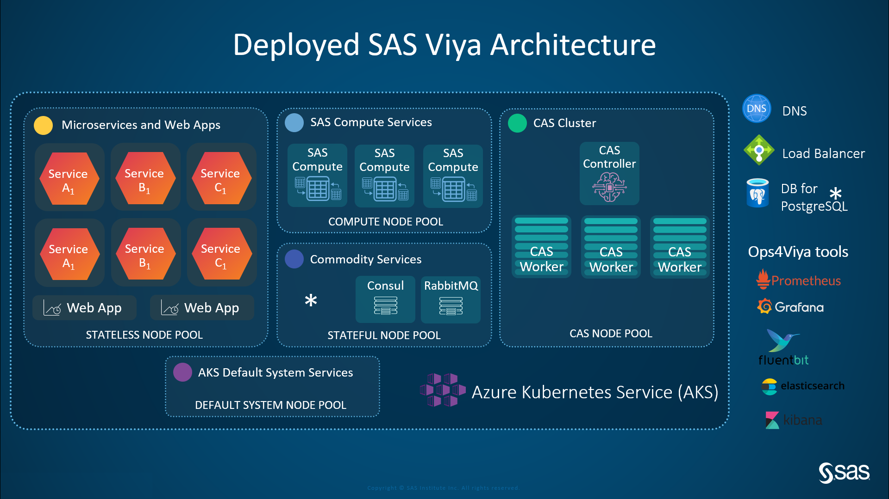

# SAS deployment instructions based on Terraform Infrastructure-as-Code (IaC) tool to deploy SAS Viya 4 (cadence 2020.0.6) on Azure Kubernetes Service (AKS) and Azure Database for PostgreSQL.

## Version 2020.0.2 from 28OCT2020 tunned by pedro.dias@sas.com for the IBERIA team.

# This project represents an evolution of the content that will be delivered by the Global Enablement Learning training course PSGEL255, that is being prepared by the GEL team and is planned to be rolled out during November.

# BIG congratulations for the incredible work that was done by Raphael.Poumarede@sas.com, Erwan.Granger@sas.com, Frederik.Vandenberghe@sas.com and the rest of the contributors of the GEL and GTP teams. All the credits are for their work!!

## In order to facilitate the firewall rules to access the Azure environment, having a VPN tunnel Direct to Cary is required (profile 3 usually).

## The GEL Open LDAP is deployed as a container Passwords of users are "lnxsas". The "sasadm" is an unrestricted administrator.

## No valid TLS certifications are applied.

## SAS deployed software is based on 9CDZDD order. Check the order at: http://comsat.sas.com/ "Order Number" "equals to" filter to your order number 

## The entire deployment will take [~1] hour.

## The architecture of the SAS environment is represented by the following compute resources:
*Five AKS node pools with VMs that will support the k8s cluster (every VM have 200 GB of storage):*
- 1 x Standard_D5_v2 for system (auto_scaling with max_count 2)
- 1 x Standard_E4s_v3 for CAS (auto_scaling with no max_nodes)
- 1 x Standard_E4s_v3 for Compute (auto_scaling with no max_nodes)
- 1 x Standard_D4s_v3 for Stateless Services (auto_scaling with no max_nodes)
- 1 x Standard_D8s_v3 for Stateful Services  (auto_scaling with max_nodes=5)

*One managed database-as-a-service (DBaaS) of Azure DB for PostgreSQL:*
- 1 x Azure DB for PostgreSQL

*Plenty of other objects, such as:*
- 1 x resource group for AKS and the PostgreSQL Database
- 1 x network security group for AKS and the PostgreSQL Database
- 1 x virtual network for AKS and the PostgreSQL Database
- 1 x resource group for the AKS nodes
- 1 x network security group for AKS nodes
- 1 x route table for AKS nodes
- 4 x storage accounts, general purpose v2, one for each AKS node
- 4 x standard SSD disk, one for each AKS node
- 1 x load balancer for AKS
- 2 x public IP address, one for AKS and another for the load balancer
- 1 x DNS alias

## SAS deployed software
*Order: 9CDZDD*

- SAS Data Preparation
- SAS Data Quality
- SAS Econometrics
- SAS Event Stream Manager
- SAS Event Stream Processing
- SAS In-Database Technologies for Hadoop
- SAS In-Database Technologies for Spark
- SAS In-Database Technologies for Teradata
- SAS Intelligent Decisioning
- SAS Model Manager
- SAS Optimization
- SAS Text Analytics for French
- SAS Text Analytics for Italian
- SAS Text Analytics for Spanish
- SAS Visual Analytics
- SAS Visual Data Mining and Machine Learning
- SAS Visual Forecasting
- SAS Visual Statistics
- SAS Visual Text Analytics
- SAS/ACCESS Interface to Amazon Redshift
- SAS/ACCESS Interface to DB2
- SAS/ACCESS Interface to Google BigQuery
- SAS/ACCESS Interface to Greenplum
- SAS/ACCESS Interface to HAWQ
- SAS/ACCESS Interface to Hadoop
- SAS/ACCESS Interface to Impala
- SAS/ACCESS Interface to JDBC
- SAS/ACCESS Interface to Microsoft SQL Server
- SAS/ACCESS Interface to MongoDB
- SAS/ACCESS Interface to MySQL
- SAS/ACCESS Interface to Netezza
- SAS/ACCESS Interface to ODBC
- SAS/ACCESS Interface to Oracle
- SAS/ACCESS Interface to PC Files
- SAS/ACCESS Interface to PostgreSQL
- SAS/ACCESS Interface to R/3
- SAS/ACCESS Interface to SAP ASE
- SAS/ACCESS Interface to SAP HANA
- SAS/ACCESS Interface to Salesforce
- SAS/ACCESS Interface to Snowflake
- SAS/ACCESS Interface to Spark
- SAS/ACCESS Interface to Teradata
- SAS/ACCESS Interface to Vertica
- SAS/CONNECT
- SAS/QC
- Risk Modeling Add-on for - SAS Visual Data Mining and Machine Learning

## Outline

There are three sections in this project:

- [Deploy the infrastructure, namelly Azure Kubernetes Service (AKS) and Azure Database for PostgreSQL](./1-deploy-aks-postgresql.md)
- [Deploy SAS Viya on top of the prepared infrastructure](./2-deploy-viya.md)
- [Deploy the Ops4Viya monitoring and logging tools](./3-deploy-ops4viya.md)

## Contributions

This project wouldn't be what it is without the continuous feedback I have to receive.
All contributions are welcome, so please raise an issue and address it to me ;-)

## Let's get started!
*[PULL THE TRIGGER AND BEGIN YOUR JOURNEY OF DEPLOYING VIYA ON AKS](./1-deploy-aks-postgresql.md)*

#
*Useful reading:*
- *[SAS Viya Administration 2020.0.5](https://go.documentation.sas.com/?cdcId=sasadmincdc&cdcVersion=v_005&docsetId=sasadminwlcm&docsetTarget=home.htm&locale=en)*
- *[SAS Viya Operations 2020.0.5](https://go.documentation.sas.com/?cdcId=itopscdc&cdcVersion=v_005&docsetId=itopswlcm&docsetTarget=home.htm&locale=en)*
